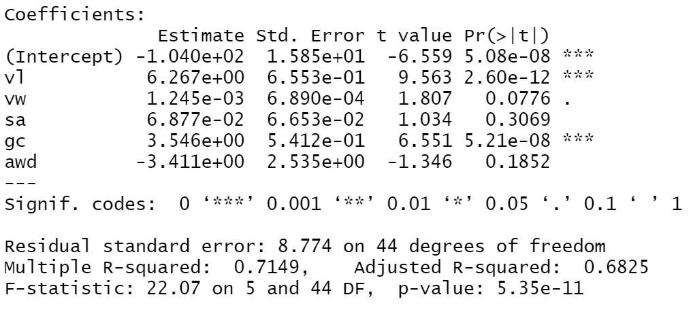
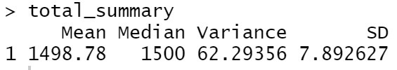
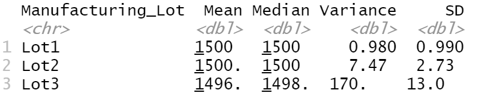
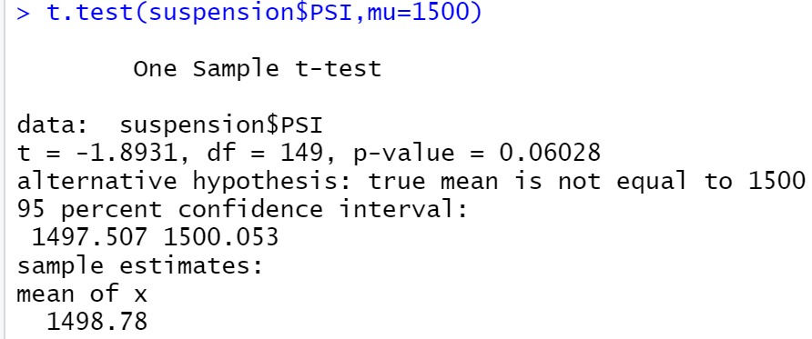
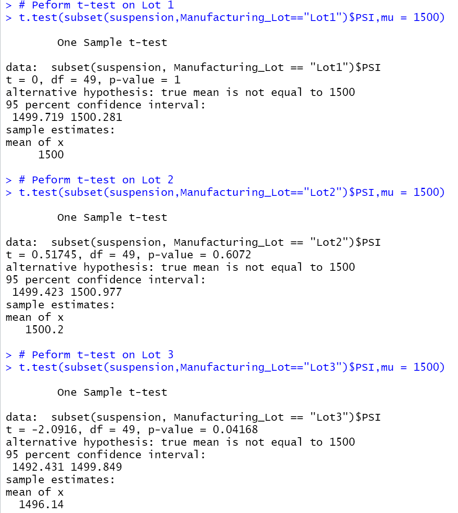

# MechaCar_Statistical_Analysis

## Overview of Project
  Using R and RStudio, implement data analysis on the produciton data of AutosRUs' newest prototype, the MechaCar, to identify the variable that could be causing its production trouble.
  
### Purpose:   
   The purpose of this analysis is to implement technical analysis on produciton data and propose for further statistical study to identify the cause of its newest prototype's production trouble. Thus, we implement following data analysis:
   - Perform multiple linear regression analysis to identify which variables in the dataset predict the mpg of MechaCar prototypes
  - Collect summary statistics on the pounds per square inch (PSI) of the suspension coils from the manufacturing lots
  - Run t-tests to determine if the manufacturing lots are statistically different from the mean population
  - Design a statistical study to compare vehicle performance of the MechaCar vehicles against vehicles from other manufacturers. For each statistical analysis, you’ll write a summary interpretation of the findings.
   

### Reources
- Used data resources: `MechaCar_mpg.csv`, `Suspension_Coil.csv`
- Used Software and Service: R, RStudio

## Analysis 
### Linear Regression to Predict MPG

  
  - Based on the linear regression summary provided, we can confirm that 'vehicle_length,' 'ground_clearance,' and also the 'slope intercept' provided a non-random amount of variance the mpg values in the dataset as those variables have signifant codes of `***` and probability.
  - Also, the slope of the linear model is **NOT** zero, as its p-value is **5.35e^-11** and lower than the regular significance level of 0.05%.
  - Lastly, to evaluate if this linear model predict mpg of MechCar prototypes effectively, we can say that the model predicts correctly about 71% of the time as the model's R-squared value is 0.7149. Since we see that the model's slope intercept is significant in predicting mpg, we can assess that there are other factors not included in this model that affect the mpg variability of the MechaCar prototypes.

### Summary Statistics on Suspension Coils

  
  
  
  
  Given the design specifications for the MechaCar suspension coils dictate that the variance of the suspension coils must not exceed 100 pounds per square inch, we can evaluate if the three Lots in the dataset do meet with the criteria. Based on the output from `lot_summary` dataframe, the variance of Lot 1 and Lot 2 are smaller than 100, but the Lot 3 exceeds it. Thus Lot 3 does not meet with the design spcification for manufacturing lots and need to be reviewed.
  
### T-Tests on Suspension Coils

  
  
  
  
  Reviewing the p-values of each Lot and the entire population mean, we can see that Lot 3's p-value is 0.042 and shows that there is significant evidence that suspension coild is different from the population mean.
  
### Study Design: MechaCar vs Competition
  Lastly, we will design a statistical study to compare performance of the MechaCar vehicles against performance of vehicles from other competitors. 
  In addition to the MPG, which we focused on this analysis earlier, I suggest to test the maintenance cost of the vehicle against other competitors. Then, we should create a null hypothesis that there is no difference in maintenance cost from the competitor, and an alternative hypothesis that there is a difference. We can test this hypothesis by conducting t-test with sufficient amount of competitors' information in regards to the maintenance cost of variety of vehicle types. Running t-test would test the hypothesis properly as t-test can compare the mean of MechCar's maintenance cost with the mean cost of the rest of vehicles (population). If the test shows that there is a statistically significant differenec in maintenance cost between the sample and the population, then we can reject the nul hypothesis. Note that in order to have this test run properly, we need to collect sufficient amount of verhicle data to ensure that population data is normally distributed.

